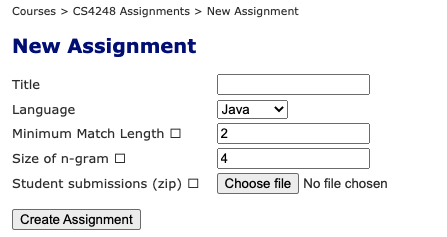
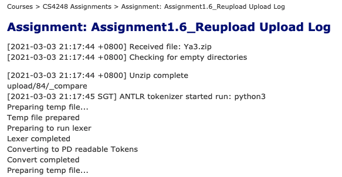
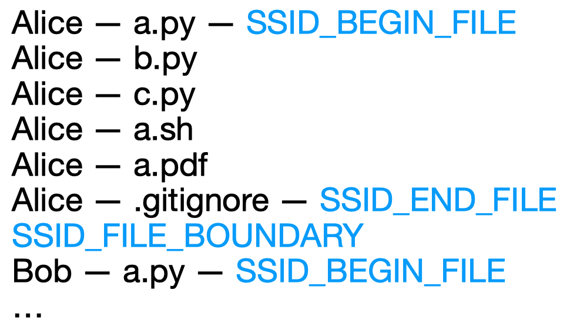

# Introduction

Yisong is trying to spend a few weeks on Issue #8 (because it's the easiest! 😛). 

Here is his design review.


# Design Review

https://github.com/WING-NUS/SSID/issues/8 


## Where?

First off, we need to clarify where to mark and understand different files.



Now the logic of SSID is that, when we hit "Create Assignment" button, it goes back to the main page.

So shall we create a pop up window to display the files? Or we just show it in the Upload Log?



Image excerpted from http://ssid-i.comp.nus.edu.sg/courses/12/assignments/84/log 

So far the Upload Log is not very informative. We can add the file information here?


## How?

I can see Min's instruction in https://github.com/WING-NUS/SSID/issues/8, but I am not quite clear:

```
Add three lines
FILE A --- SSID_END_FILE
SSID_FILE_BOUNDARY
FILE B --- SSID_BEGIN_FILE
```

So I draw one prototype. Please advise me.




Q1: Is my understanding correct?

Q2: Should we mark those files that will NOT be processed by SSID, like `Alice - a.pdf`?


